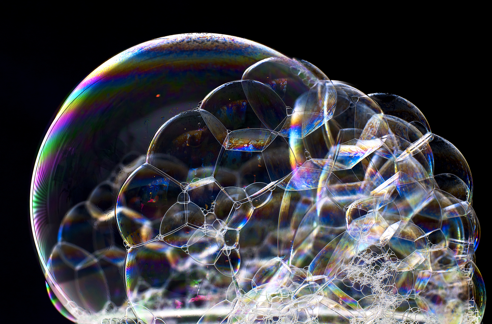
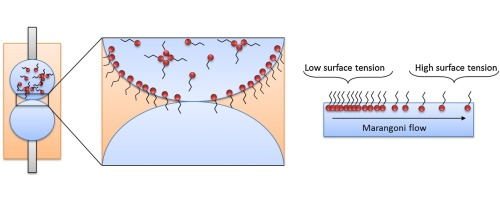
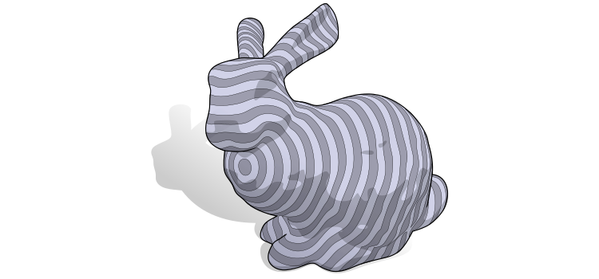
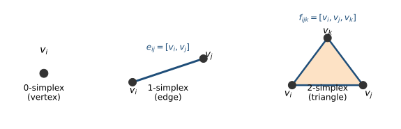
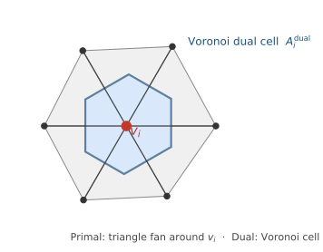
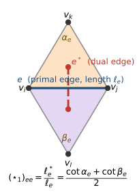
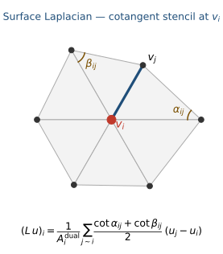
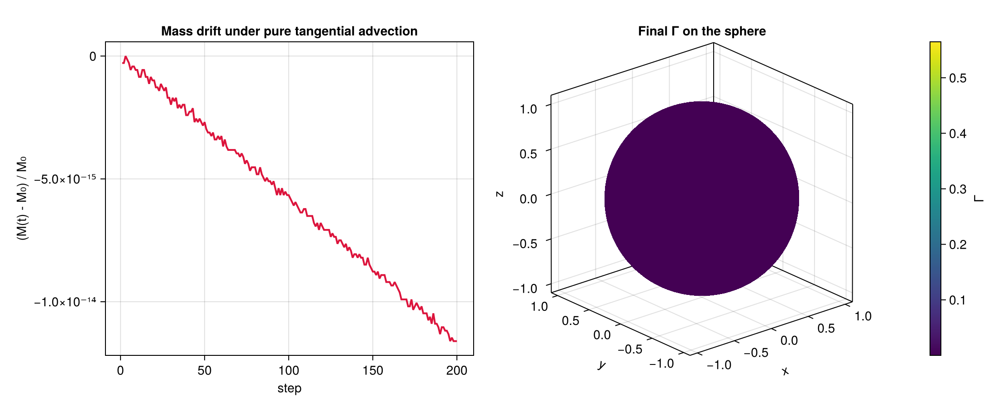

# Motivation {background-color="#1a1a2e"}

## Physics confined to the interface

:::{.columns}
::: {.column width="58%"}
{width=100%}

:::

::: {.column width="42%"}
::: {.r-fit-text}
Membranes, droplets, bubbles, thin films:
:::

::: {.r-fit-text}
the physics lives on $\Gamma$.
:::

The interface is a **computational domain**, not only a boundary condition.
:::
:::

## Why a surface field changes the physics

:::{.columns}
::: {.column width="45%"}

{width=92%}

:::
::: {.column width="55%"}

**A small surface concentration can change the bulk motion.**

Let $c_\Gamma(\mathbf{x},t)$ be the **surface concentration** - molecules adsorbed per unit interfacial area, $[c_\Gamma] = \mathrm{mol\,m^{-2}}$ - living **on** the interface $\Gamma(t)$.

- $c_\Gamma$ is advected and diffuses **along** the interface.
- $c_\Gamma$ changes $\sigma(c_\Gamma)$ (the surface tension).
- $\nabla_\Gamma\sigma$ creates Marangoni stress.
- The interface can immobilise, deform, or stop coalescence.

:::
:::

::: {.callout-important}
The unknown lives **on** $\Gamma$ and obeys its own transport law:
$\Gamma$ must be discretized as a surface domain.
:::

## A sharp Two-phase interface model [@Bothe_2022]

Couples bulk Navier–Stokes + species, an interface stress jump (Young–Laplace + Marangoni), and - the focus of this talk - a **surface PDE** for $c_\Gamma$ on $\Gamma(t)$:

$$\boxed{\;\partial_t^\bullet c_\Gamma \;+\; c_\Gamma\,\nabla_\Gamma\!\cdot\!\mathbf{u}_\Gamma \;-\; \nabla_\Gamma\!\cdot\!\bigl(D_s\nabla_\Gamma c_\Gamma\bigr) \;=\; \bigl[\!\bigl[D\nabla c\cdot\mathbf{n}\bigr]\!\bigr]\;}$$

* $\partial_t^\bullet c_\Gamma = \frac{\partial c_\Gamma}{\partial t} + c_\Gamma\,\mathbf{u}_\Gamma \cdot \nabla_\Gamma$ - Thomas derivative following the motion of $\Gamma(t)$.
* $c_\Gamma\,\nabla_\Gamma\!\cdot\!\mathbf{u}_\Gamma$ - **area-change** source from stretching of the moving surface.
* $-\nabla_\Gamma\!\cdot\!(D_s\nabla_\Gamma c_\Gamma)$ - surface diffusion.
* $[\![D\nabla c\cdot\mathbf{n}]\!]$ - adsorption/desorption flux from the bulk phases.

::: {.callout-note}
The boxed equation is the **surface PDE** - $\Gamma(t)$ is the computational domain. The bulk only enters through the right-hand side $[\![D\nabla c\cdot\mathbf{n}]\!]$.
:::

# Surface PDEs - the continuous picture {background-color="#1a1a2e"}

## The surface as computational domain

:::{.columns}
::: {.column width="56%"}

Let $\Gamma \subset \mathbb{R}^3$ be a smooth surface. A scalar field lives **on** $\Gamma$:

$$u : \Gamma \to \mathbb{R}$$

**Tangential differential operators:**

$$\nabla_\Gamma u = \underbrace{(\mathbf{I} - \mathbf{n}\otimes\mathbf{n})}_{\mathbf{P}}\,\nabla u, \qquad \Delta_\Gamma u = \nabla_\Gamma \cdot \nabla_\Gamma u$$

The normal direction is **projected out** - everything lives in the tangent plane.

:::
::: {.column width="44%"}

{width=100%}

*Figure: Crane - DDG: An Applied Introduction (CMU)*

:::
:::

## Model problems

**On a moving interface** $\Gamma(t)$, the surface transport equation :

$$\underbrace{\partial_t^\bullet c_\Gamma}_{\substack{\text{rate following}\\ \text{normal motion}}} + \underbrace{c_\Gamma\,\nabla_\Gamma\!\cdot\!\mathbf{u}_\Gamma}_{\substack{\text{surface dilatation}\\ \text{(area stretches)}}} - \underbrace{\nabla_\Gamma\!\cdot\!(D_s\nabla_\Gamma c_\Gamma)}_{\text{surface diffusion}} = \underbrace{\bigl[\!\bigl[D\nabla c\cdot\mathbf{n}\bigr]\!\bigr]}_{\substack{\text{bulk}\\ \text{adsorption}}}$$

Here $\nabla_\Gamma\!\cdot\!\mathbf{u}_\Gamma$ is the **surface divergence of the full interface velocity** - it measures the local rate at which the moving surface stretches; on a sphere growing outward, $\nabla_\Gamma\!\cdot\!\mathbf{u}_\Gamma = 2 V_n / R$. That stretching dilutes $c_\Gamma$.

Getting the geometry right is not optional.

::: {.r-fit-text}
How do we discretize $\nabla_\Gamma$, $\nabla_\Gamma \cdot$, $\Delta_\Gamma$
without embedding coordinates everywhere?
:::

# Discrete Differential Geometry and DEC {background-color="#1a1a2e"}

## The central question

::: {.r-fit-text}
How do we discretize $\nabla_\Gamma$, $\nabla_\Gamma \cdot$, $\Delta_\Gamma$
without embedding coordinates everywhere?
:::

DEC [@Crane:2013:DGP] separates two ingredients cleanly:

:::{.columns}
::: {.column width="50%"}

### Topology
Encoded by **incidence matrices** $d_0, d_1$.

Exact by construction - no quadrature.

Independent of the metric.

:::
::: {.column width="50%"}

### Geometry
Encoded by **Hodge stars** $\star_0, \star_1, \star_2$.

Local metric ratios (areas, lengths).

Separate from the combinatorial structure.

:::
:::

## The simplicial complex

{fig-align="center" width=78%}

A triangulated surface is a **simplicial 2-complex** - three kinds of cells:

| Cell | What it carries |
|------|-----------------|
| Vertex $v_i$ (0-simplex) | a scalar value $u_i$ |
| Edge $e_{ij}$ (1-simplex) | a flux $\omega_{ij}$ integrated along the edge |
| Triangle $f_{ijk}$ (2-simplex) | a density integrated over the triangle |

These are **integrated** quantities on geometric cells - not nodal samples. That is what makes the discrete operators conservative by construction.

## Primal mesh and dual mesh

:::{.columns}
::: {.column width="50%"}

{fig-align="center" width=92%}

:::
::: {.column width="50%"}

**Two complementary meshes:**

* **Primal** - triangles, edges, vertices.
* **Dual** - Voronoi cells around each vertex, dual edges across primal edges.

Every primal cell pairs with one dual cell of complementary dimension:

| Primal | Dual |
|:--|:--|
| vertex $v_i$ | Voronoi area $A_i^{\mathrm{dual}}$ |
| edge $e_{ij}$ | perpendicular dual edge $e^*$ |
| triangle $f_{ijk}$ | its circumcenter |

The Voronoi area $A_i^{\mathrm{dual}}$ around vertex $i$ is the **integration weight** carried by a scalar value $u_i$.

:::
:::

## Discrete gradient and curl - $d_0$, $d_1$

**$d_0$ - difference along edges** (discrete gradient):

$$(d_0\, u)_{ij} = u_j - u_i.$$

A scalar value on vertices $(u_i)$ becomes an edge quantity $(d_0 u)_{ij}$: the **change in $u$** along edge $e_{ij}$.

**$d_1$ - circulation around triangles** (discrete curl):

$$(d_1\,\omega)_{ijk} = \omega_{ij} + \omega_{jk} - \omega_{ki}.$$

An edge quantity $(\omega_{ij})$ becomes a triangle quantity: the **signed sum around the boundary** of the triangle (Stokes' theorem, discretely).

:::{.columns}
::: {.column width="55%"}

::: {.callout-important title="Conservation, not interpolation"}
$d_0$ and $d_1$ are **incidence matrices** built from the mesh connectivity alone - no metric, no quadrature, no choice of basis.

They are exact by construction:

$$d_1\, d_0 = 0 \quad \Longleftrightarrow \quad \nabla\!\times\!\nabla u \equiv 0.$$
:::

:::
::: {.column width="45%"}

Reading $d_0$ on the edge $e_{ij}=[v_i,v_j]$:

* $u_i, u_j$ live on vertices.
* $(d_0 u)_{ij} = u_j - u_i$ integrates $\nabla u$ along the edge - by the fundamental theorem of calculus, **exactly**.
* No piecewise-linear interpolation is needed for the discrete law to hold.

:::
:::

## The Hodge star - where the geometry enters

:::{.columns}
::: {.column width="50%"}

{fig-align="center" width=92%}

:::
::: {.column width="50%"}

The Hodge star $\star$ pairs each primal cell with its dual cell through a **local metric ratio**:

$$\star_0 = \mathrm{diag}(A_i^{\mathrm{dual}}), \qquad \star_2 = \mathrm{diag}(1/A_f),$$

$$(\star_1)_{ee} = \frac{\ell_e^{*}}{\ell_e} = \frac{\cot\alpha_e + \cot\beta_e}{2}.$$

This is the **only** place lengths and areas enter. Topology ($d_0,d_1$) stays metric-free; $\star$ carries every geometric quantity.

:::
:::

## The surface Laplacian

Assembled by composing the discrete gradient, metric, and divergence:

$$\boxed{L = \star_0^{-1}\,d_0^\top\,\star_1\,d_0}$$

Read right to left: **gradient** ($d_0$) → **metric** ($\star_1$) → **divergence** ($d_0^\top$) → **normalize** by dual area ($\star_0^{-1}$).

:::{.columns}
::: {.column width="48%"}

{fig-align="center" width=100%}

:::
::: {.column width="52%"}

Expanded at vertex $i$, this is the familiar **cotangent stencil**:

$$
(L\,u)_i = \frac{1}{A_i^{\mathrm{dual}}}\sum_{j \sim i} \frac{\cot\alpha_{ij} + \cot\beta_{ij}}{2}\,(u_j - u_i),
$$

intrinsic to the mesh, symmetric positive semi-definite, second-order convergent - the standard surface Laplacian, derived two ways (DEC and cotangent FEM) giving the same matrix.

:::
:::

# Our implementation {background-color="#1a1a2e"}

## Static results - diffusion & convergence {.center}

:::{.columns}
::: {.column width="50%"}

<video src="figures/18_bunny_diffusion.mp4" width="100%" autoplay loop muted playsinline></video>

Heat equation on the Stanford bunny (2562 v / 4968 f): $\partial_t u = D\Delta_\Gamma u$, Crank–Nicolson. $L$ assembled directly from incidence + Hodge stars - no analytic surface.

:::
::: {.column width="50%"}

**Spatial convergence - heat on $S^2$**, manufactured solution $u = e^{-2 D t}\, z$:

| Level | $n_v$ | $L^2$ error | Order |
|:--:|:--:|:--:|:--:|
| 1 | 42   | $1.06\times10^{-3}$ | - |
| 2 | 162  | $5.33\times10^{-4}$ | 1.03 |
| 3 | 642  | $1.63\times10^{-4}$ | 1.73 |
| 4 | 2562 | $3.88\times10^{-5}$ | **2.07** |

::: {.callout-tip title="Algebraic invariants (Tier 0)"}
$\|d_1\,d_0\|_\infty = 0$ · $\|L_{\rm DEC}-L_{\rm cot}\|_\infty<10^{-12}$ · constants preserved to $10^{-16}$.
:::

:::
:::

## Reaction–diffusion & conservation {.center}

:::{.columns}
::: {.column width="50%"}

**Conservation under tangential advection**

{width=100%}

Solid-body rotation on $S^2$, SSP-RK3: mass drift $\sim 10^{-14}$.

:::
::: {.column width="50%"}

**Brusselator Turing patterns on $S^2$**

<video src="figures/13_turing_sphere.mp4" width="100%" autoplay loop muted playsinline></video>

Two-species IMEX: diffusion implicit, reaction explicit.

:::
:::

# Moving surfaces {background-color="#1a1a2e"}

## From static to moving interfaces

For a **moving** surface $\Gamma(t)$, the governing equation becomes:

$$\partial_t^\bullet u + u\,\nabla_\Gamma\!\cdot\mathbf{u}_\Gamma - D\,\Delta_\Gamma u = f.$$

Even with no tangential advection, normal motion enters through the **area-change term** $u\,\nabla_\Gamma\!\cdot\!\mathbf{u}_\Gamma$.

:::{.columns}
::: {.column width="55%"}

**The 4D space-time manifold over one slab:**

$$\mathcal{G} = \bigcup_{t \in [t^n,\, t^{n+1}]} \Gamma(t) \subset \mathbb{R}^3\times\mathbb{R}.$$

Apply DEC to this 4D manifold:

* Prisms $\Gamma^n \to \Gamma^{n+1}$ decomposed into tetrahedra.
* DEC operators assembled on the 4D space-time complex.
* Geometry and transport handled **together**.

:::
::: {.column width="45%"}

::: {.callout-important title="Why space-time?"}
"Update geometry, then solve" strategies break conservation on moving surfaces. Assembling DEC on the 4D space-time manifold restores it by treating geometry and transport as one coupled problem.
:::

:::
:::

## FrontSpaceTimeDEC.jl - moving-surface DEC

:::{.columns}
::: {.column width="55%"}

**Space-time DEC library in Julia:**

* Builds the 4D space-time manifold $\Gamma^n \to \Gamma^{n+1}$ as a single slab.
* Prism decomposition: edge-sweeps → triangles, triangle-prisms → tetrahedra.
* DEC operators on the 4D space-time complex.
* Diffusion · transport · advection–diffusion (BE + CN).
* **Coupled solver**: $V_n = \mathcal{F}(u,\,\nabla_\Gamma u,\,\kappa,\,\ldots)$.

Handles curve slabs $(x,y,t)$ and surface slabs $(x,y,z,t)$.

[github.com/PenguinxCutCell/FrontSpaceTimeDEC.jl](https://github.com/PenguinxCutCell/FrontSpaceTimeDEC.jl)

:::
::: {.column width="45%"}

**Tiered validation:**

| Tier | Coverage |
|------|----------|
| 0 | Algebra / geometry invariants |
| 1 | Exact solutions |
| 2 | Manufactured solutions |
| 3 | Coupled nonlinear |

:::
:::

## Moving results - prescribed, coupled, surfactant {.center}

:::{.columns}
::: {.column width="33%"}

**Expanding sphere** - prescribed $V_n$

<video src="figures/21_expanding_sphere.mp4" width="100%" autoplay loop muted playsinline></video>

Exact ODE for $u(t) = u_0 e^{-2 D t/R(t)^2}$ on a growing sphere.

*4-level convergence: $L^2 = 2.10\!\times\!10^{-4} \to 2.47\!\times\!10^{-5}$, order $\to 1.83$.*

:::
::: {.column width="33%"}

**Crystal growth** - coupled $V_n = M(u-u_{\rm eq})$

<video src="figures/20_crystal_growth.mp4" width="100%" autoplay loop muted playsinline></video>

Interface advances faster where supersaturation is high; surface diffusion smooths morphology.

*Picard-coupled Stefan-type, fully on the 4D space-time slab.*

:::
::: {.column width="34%"}

**Surfactant on a rising bubble** - Hadamard

<video src="figures/19_rising_bubble.mp4" width="100%" autoplay loop muted playsinline></video>

Bubble translates upward; surfactant accumulates in a rear stagnant cap.

*DEC matches $\Gamma\propto e^{-\mathrm{Pe}\cos\theta}$ to **<3.5%** (log-$L^2$, $\mathrm{Pe}\le 10$).*

:::
:::

::: {.callout-tip}
Three regimes, **one solver**: prescribed motion · coupled motion · advection–diffusion on a moving $\Gamma(t)$. Mass conservation at machine precision in the coupled sphere benchmark ($3.05\!\times\!10^{-16}$).
:::

# Summary {background-color="#1a1a2e"}

## Why this matters for multiphase flows

The Bothe model demands a surface PDE solver as a first-class component:

:::{.columns}
::: {.column width="55%"}

* Surfactant transport on droplets and bubbles
* Interfacial adsorption/desorption kinetics
* Marangoni-driven flows - $\nabla_\Gamma\sigma(\Gamma_s)$
* Membrane mechanics and biological interfaces
* Phase-change chemistry at the interface

:::
::: {.column width="45%"}

::: {.callout-note title="The DEC payoff"}
$$\underbrace{d_0,\, d_1}_{\text{topology: exact}} \;+\; \underbrace{\star_0,\, \star_1,\, \star_2}_{\text{geometry: local metric}}$$

Conservation, compatibility, geometry-awareness - **built in**, not bolted on.
:::

:::
:::

::: center
When the interface carries its own physics, multiphase models need a surface PDE solver as a first-class component.
:::

## What the packages do {.center}

:::{.columns}
::: {.column width="50%"}

**FrontIntrinsicOps.jl** - static DEC
\
\

* DEC + cotangent Laplace–Beltrami
* Barycentric **and** Voronoi dual areas
* Heat-method geodesics
* Whitney FEEC layer
* Surface diffusion: BE / Crank–Nicolson
* Advection–diffusion: IMEX
* Reaction–diffusion (Turing/Brusselator)
* Mesh / STL / OBJ I/O · Makie extension

:::
::: {.column width="50%"}

**FrontSpaceTimeDEC.jl** - moving DEC
\
\

* One-slab 4D space-time manifold $\Gamma^n\to\Gamma^{n+1}$
* Prism → tetrahedron space-time complex
* DEC operators on the 4D complex
* Diffusion · transport · advection-diffusion
* Coupled solver $V_n=\mathcal F(u,\nabla_\Gamma u,\kappa)$
* Curve $(x,y,t)$ and surface $(x,y,z,t)$ slabs
* Tiered validation (Tier 0–4, all green)

:::
:::

::: {.callout-tip}
Both are open-source Julia packages with the same DEC core: topology ($d$) assembled apart from geometry ($\star$), combined into structure-preserving operators.
:::

## Take-home {.center}

:::{.columns}
::: {.column width="55%"}

**What we built:**

1. The Bothe model demands solving a surface PDE - $\Gamma_s$ on $\Gamma(t)$
2. DDG/DEC gives structured discrete operators: topology $\perp$ geometry
3. **FrontIntrinsicOps.jl** - static DEC: $d$, $\star$, $L$, geodesics, IMEX transport
4. **FrontSpaceTimeDEC.jl** - moving DEC: 4D space-time slabs, coupled dynamics, mass-conservative

**Perspectives:**

* Full coupling with bulk Navier–Stokes solver
* Space-time DEC for topology-changing fronts
* Vector/tensor surface PDEs

:::
::: {.column width="45%"}

::: {.callout-important}
Solve the PDE **on the interface itself**.

DEC gives a clean, structured way to do exactly that.
:::

---

[FrontIntrinsicOps.jl](https://github.com/PenguinxCutCell/FrontIntrinsicOps.jl)

[FrontSpaceTimeDEC.jl](https://github.com/PenguinxCutCell/FrontSpaceTimeDEC.jl)

---

*DDG figures: Keenan Crane (CMU) - [cs.cmu.edu/~kmcrane](https://www.cs.cmu.edu/~kmcrane/)*

:::
:::

# References {.appendix visibility="uncounted"}

::: {#refs}
:::

# Appendix {.appendix visibility="uncounted"}

## Appendix - Continuous identities

$$\nabla_\Gamma u = (\mathbf{I} - \mathbf{n}\otimes\mathbf{n})\nabla u, \qquad \Delta_\Gamma u = \nabla_\Gamma\cdot\nabla_\Gamma u, \qquad \partial_t^\bullet u = \partial_t u + \mathbf{u}_\Gamma\cdot\nabla u$$

## Appendix - DEC dictionary

| Continuous | Discrete |
|---|---|
| 0-form | values at vertices |
| 1-form | fluxes on edges |
| 2-form | densities on faces |
| exterior derivative $d$ | incidence matrix |
| Hodge star $\star$ | primal/dual metric ratio |
| $d^2 = 0$ | $d_1 d_0 = 0$ - exact by topology |

## Appendix - Full Bothe system

**Bulk adsorption coupling** at $\Gamma(t)$:

$$D^\pm\nabla c^\pm\cdot\mathbf{n}^\pm = \mp j^\pm_\Gamma, \qquad j^\pm_\Gamma = k_a^\pm\,c^\pm\big|_\Gamma - k_d^\pm\,\Gamma_s \quad \text{(Henry/Langmuir)}$$

**Net adsorption flux** entering the surface PDE:

$$\bigl[\!\bigl[D\nabla c\cdot\mathbf{n}\bigr]\!\bigr] = j^+_\Gamma - j^-_\Gamma$$

## Appendix - Cotangent formula

$$
(L\,u)_i = \frac{1}{A_i}\sum_{j \sim i} \frac{\cot\alpha_{ij} + \cot\beta_{ij}}{2}(u_j - u_i)
$$

where $\alpha_{ij}$, $\beta_{ij}$ are the angles opposite edge $ij$, and $A_i$ is the dual (Voronoi) area at vertex $i$.
