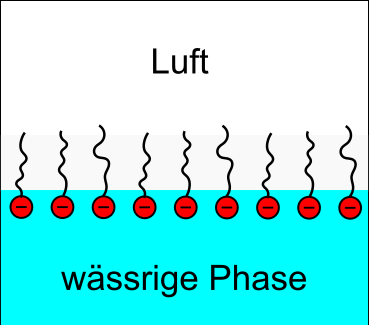
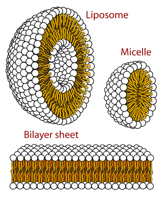
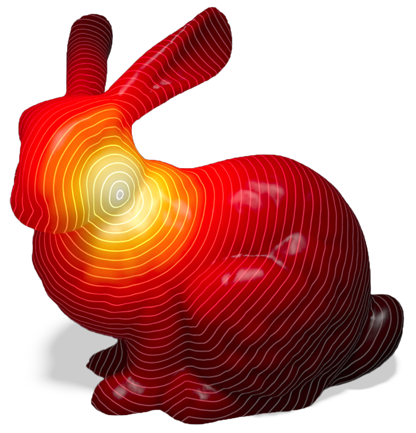
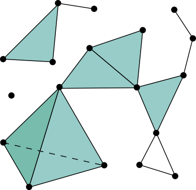
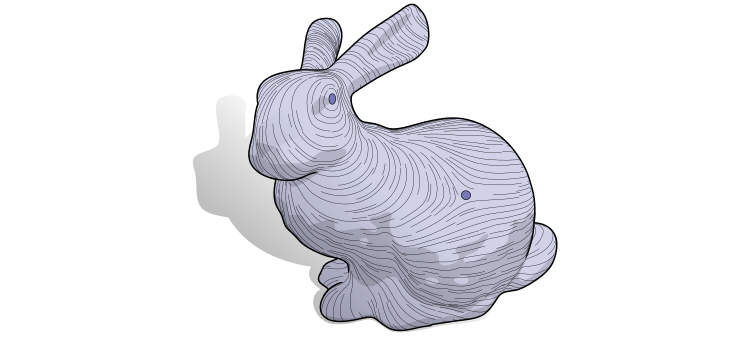
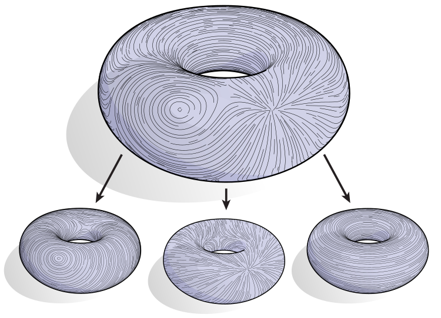
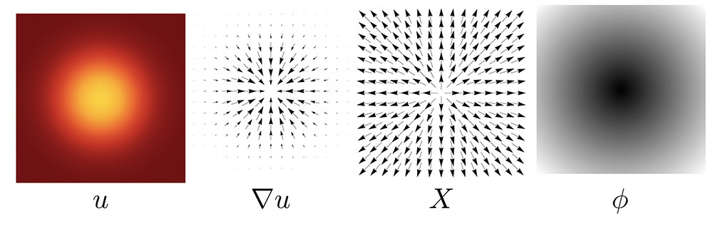

# Motivation {background-color="#1a1a2e"}

## Physics confined to the interface

:::{.columns}
::: {.column width="33%"}
{width=100%}
:::
::: {.column width="34%"}
{width=100%}

*Source: Wikimedia Commons*
:::
::: {.column width="33%"}
{width=100%}

*Source: Wikimedia Commons*
:::
:::

::: {.callout-important}
Membranes · Droplets · Bubbles · Thin films — the **interface itself** carries the physics.
If the layer is thin and active, the interface must be a **computational domain**, not just a boundary.
:::

## What surface PDEs can do

:::{.columns}
::: {.column width="52%"}

Solve a PDE **directly on the triangulated interface**:

* **Surface diffusion** — heat, concentration, temperature
* **Surface advection** — tangential transport on moving drops
* **Reaction–diffusion** — interfacial chemistry, Turing patterns
* **Hodge decomposition** — tangent vector fields on surfaces

All from a single discrete operator framework: **DEC**.

:::
::: {.column width="48%"}

{width=100%}

*Figure: Crane, Weischedel, Wardetzky — The Heat Method, ACM TOG (CMU)*

:::
:::

## The Bothe sharp interface model

For a two-phase flow with a **soluble surfactant** (Bothe, Köhne, Prüss 2012):

:::{.columns}
::: {.column width="50%"}

**Bulk phases** $\Omega^\pm(t)$:

$$\rho^\pm\bigl(\partial_t\mathbf{u} + \mathbf{u}\cdot\nabla\mathbf{u}\bigr) = -\nabla p + \nabla\cdot(2\mu^\pm\mathbf{D}) + \rho^\pm\mathbf{g}$$

$$\nabla\cdot\mathbf{u} = 0, \qquad \partial_t c^\pm + \mathbf{u}\cdot\nabla c^\pm = \nabla\cdot(D^\pm\nabla c^\pm)$$

**Kinematic condition** at $\Gamma(t)$:

$$V_n = \mathbf{u}_\Gamma\cdot\mathbf{n}$$

:::
::: {.column width="50%"}

**Stress jump** (Young–Laplace + Marangoni):

$$\bigl[\![-p\mathbf{I} + 2\mu\mathbf{D}\bigr]\!]\cdot\mathbf{n} = \sigma(\Gamma_s)\,\kappa\,\mathbf{n} - \nabla_\Gamma\sigma$$

**Surfactant transport on $\Gamma(t)$** — a surface PDE:

$$\boxed{\partial_t^\bullet\Gamma_s + \Gamma_s\,\nabla_\Gamma\cdot\mathbf{u}_\Gamma - \nabla_\Gamma\cdot(D_s\nabla_\Gamma\Gamma_s) = \bigl[\!\bigl[D\nabla c\cdot\mathbf{n}\bigr]\!\bigr]}$$

:::
:::

::: {.callout-note}
The boxed equation is a **surface PDE** — the interface $\Gamma(t)$ is the computational domain. The right-hand side $[[D\nabla c\cdot\mathbf{n}]]$ couples bulk adsorption to the surface field.
:::

# Surface PDEs — the continuous picture {background-color="#1a1a2e"}

## The surface as computational domain

:::{.columns}
::: {.column width="55%"}

Let $\Gamma \subset \mathbb{R}^3$ be a smooth surface. A scalar field lives **on** $\Gamma$:

$$u : \Gamma \to \mathbb{R}$$

**Tangential differential operators:**

$$\nabla_\Gamma u = \underbrace{(\mathbf{I} - \mathbf{n}\otimes\mathbf{n})}_{\mathbf{P}}\,\nabla u, \qquad \Delta_\Gamma u = \nabla_\Gamma \cdot \nabla_\Gamma u$$

The normal direction is **projected out** — everything lives in the tangent plane.

:::
::: {.column width="45%"}

{width=100%}

*Figure: Crane — DDG: An Applied Introduction (CMU)*

:::
:::

## Model problems

**Three canonical surface PDEs:**

| Equation | |
|---|---|
| Surface diffusion | $\partial_t u - D\,\Delta_\Gamma u = f$ |
| Advection–diffusion | $\partial_t u + \nabla_\Gamma \cdot (u\,\mathbf{w}_\tau) - D\,\Delta_\Gamma u = f$ |
| Reaction–diffusion | $\partial_t u - D\,\Delta_\Gamma u = R(u)$ |

**The Bothe surfactant equation on a moving interface $\Gamma(t)$:**

$$\partial_t^\bullet\Gamma_s + \Gamma_s\,\nabla_\Gamma\cdot\mathbf{u}_\Gamma - \nabla_\Gamma\cdot(D_s\nabla_\Gamma\Gamma_s) = \bigl[\!\bigl[D\nabla c\cdot\mathbf{n}\bigr]\!\bigr]$$

Every term has a geometric meaning: **material transport** · **area change** · **surface diffusion** · **bulk exchange**. Getting the geometry right is not optional.

# Discrete Differential Geometry and DEC {background-color="#1a1a2e"}

## The central question

If the surface is a triangulated mesh:

::: {.r-fit-text}
How do we discretize $\nabla_\Gamma$, $\nabla_\Gamma\!\cdot$, $\Delta_\Gamma$
without embedding coordinates everywhere?
:::

DEC separates two ingredients cleanly:

:::{.columns}
::: {.column width="50%"}

### Topology
Encoded by **incidence matrices** $d_0, d_1$.

Exact by construction — no quadrature.

Independent of the metric.

:::
::: {.column width="50%"}

### Geometry
Encoded by **Hodge stars** $\star_0, \star_1, \star_2$.

Local metric ratios (areas, lengths).

Separate from the combinatorial structure.

:::
:::

## The simplicial complex

:::{.columns}
::: {.column width="45%"}

{width=85%}

*Source: Wikimedia Commons*

:::
::: {.column width="55%"}

A triangulated surface is a **simplicial 2-complex**.

**DEC lives on mesh cells:**

| Cell | Dim | Carries |
|------|-----|---------|
| Vertex $v_i$ | 0 | scalar values (0-form) |
| Edge $e_{ij}$ | 1 | tangential fluxes (1-form) |
| Face $f_{ijk}$ | 2 | area densities (2-form) |

Not nodal interpolation — **integrated quantities** on geometric cells.

Conservation and exact sequence properties follow naturally.

:::
:::

## Primal mesh and dual mesh

:::{.columns}
::: {.column width="50%"}

**Two complementary meshes:**

* **Primal** — triangles, edges, vertices
* **Dual** — Voronoi cells, dual edges, barycenters

The **Hodge star** bridges them through local metric ratios:

$$(\star_0)_{ii} = A_i^{\mathrm{dual}}, \qquad (\star_1)_{ee} = \frac{\ell_e^{*}}{\ell_e}$$

$A_i^{\mathrm{dual}}$: Voronoi area around vertex $i$

$\ell_e^{*} / \ell_e$: dual-to-primal edge ratio

:::
::: {.column width="50%"}

::: {.callout-important title="Topology vs geometry — separated"}

$$\underbrace{d_0,\; d_1}_{\text{incidence (topology)}} \qquad \underbrace{\star_0,\; \star_1,\; \star_2}_{\text{metric ratios (geometry)}}$$

Connectivity never mixes with metric.
This is the key structural property of DEC.

:::

::: {.callout-tip}
Both DEC and cotangent FEM lead to the same Laplace–Beltrami — two derivations, one operator.
:::

:::
:::

## The exterior derivative

The discrete exterior derivative is **pure incidence** — no metric needed:

$$
(d_0\, u)_{ij} = u_j - u_i, \qquad (d_1\,\omega)_{ijk} = \omega_{ij} + \omega_{jk} - \omega_{ik}
$$

**The discrete de Rham complex:**

$$
0 \longrightarrow
\underbrace{\Lambda^0}_{\text{vertices}}
\xrightarrow{\;d_0\;}
\underbrace{\Lambda^1}_{\text{edges}}
\xrightarrow{\;d_1\;}
\underbrace{\Lambda^2}_{\text{faces}}
\longrightarrow 0
$$

:::{.columns}
::: {.column width="55%"}

**Fundamental identity — exact by construction:**

$$d_1\, d_0 = 0 \quad \Longleftrightarrow \quad \nabla\!\times\!\nabla = 0, \quad \nabla\!\cdot\!\nabla\!\times = 0$$

No quadrature error — follows from the mesh topology alone.

:::
::: {.column width="45%"}

{width=100%}

*Figure: Crane — DDG (CMU)*

:::
:::

## The Hodge star and Hodge decomposition

:::{.columns}
::: {.column width="50%"}

$\star_k$ maps primal $k$-forms to dual $(2-k)$-forms:

$$\star_0 = \mathrm{diag}(A_i^{\mathrm{dual}}), \quad \star_2 = \mathrm{diag}(1/A_f)$$

$$(\star_1)_{ee} = \frac{\ell_e^{*}}{\ell_e} = \frac{\cot\alpha_e + \cot\beta_e}{2}$$

**Helmholtz–Hodge decomposition** — enabled by $\star$:

$$\mathbf{X} = \underbrace{\nabla_\Gamma f}_{\text{gradient}} + \underbrace{\nabla_\Gamma\!\times\! g}_{\text{curl}} + \underbrace{\mathbf{H}}_{\text{harmonic}}$$

:::
::: {.column width="50%"}

{width=100%}

*Figure: Crane — DDG (CMU)*

:::
:::

## The Laplace–Beltrami operator in DEC

Assemble topology + metric:

$$\boxed{L = \star_0^{-1}\,d_0^\top\,\star_1\,d_0}$$

Read right to left: **gradient** ($d_0$) → **metric** ($\star_1$) → **divergence** ($d_0^\top$) → **normalize** ($\star_0^{-1}$).

Expanding, this recovers the **cotangent formula**:

$$
(L\,u)_i = \frac{1}{A_i}\sum_{j \sim i} \frac{\cot\alpha_{ij} + \cot\beta_{ij}}{2}\,(u_j - u_i)
$$

:::{.columns}
::: {.column width="55%"}

Properties: intrinsic · symmetric positive semi-definite · second-order convergent

Same formula from DEC and cotangent FEM derivations.

:::
::: {.column width="45%"}

{width=100%}

*Figure: Crane — The Heat Method (CMU)*

:::
:::

# Our implementation {background-color="#1a1a2e"}

## FrontIntrinsicOps.jl — static DEC on front meshes

:::{.columns}
::: {.column width="52%"}

**Static interface DDG/DEC library in Julia:**

```
mesh / STL / CSV
    │
    ▼  incidence matrices   d₀, d₁
    ▼  Hodge stars          ★₀, ★₁, ★₂
    ▼  Laplace–Beltrami     L = d₀ᵀ ★₁ d₀
    ▼  transport operators
    │
    ▼  sparse assembly → solve
```

Built-in meshes: icosphere · UV sphere · torus · circle

[github.com/PenguinxCutCell/FrontIntrinsicOps.jl](https://github.com/PenguinxCutCell/FrontIntrinsicOps.jl)

:::
::: {.column width="48%"}

**Key capabilities:**

* DEC + cotangent Laplace–Beltrami
* Barycentric **and** Voronoi dual areas
* Heat-method geodesics
* Harmonic basis (topology-aware)
* Whitney FEEC layer
* Surface diffusion: BE / Crank–Nicolson
* Advection–diffusion: IMEX
* Makie visualization extension

:::
:::

## Semi-discrete form and results — static PDEs

**Discrete diffusion** $\partial_t u - D\,\Delta_\Gamma u = f$:

$$M\frac{u^{n+1}-u^n}{\Delta t} + D\,K\,u^{n+1} = b^{n+1},\qquad M = \star_0,\quad K = d_0^\top\star_1 d_0$$

**Benchmark: heat equation on $S^2$** — exact solution $u = e^{-\ell(\ell+1)t}\,Y_\ell^m$

:::{.columns}
::: {.column width="55%"}

**Spatial convergence (sphere harmonic):**

| Level | $L^2$ error | Order |
|---|---|---|
| 1 | $2.14\times10^{-4}$ | — |
| 2 | $8.89\times10^{-5}$ | 1.28 |
| 3 | $2.49\times10^{-5}$ | 1.84 |

**Static circle, CN scheme:**

| Refinement | $L^2$ error | Order |
|---|---|---|
| $h_1$ | $1.71\times10^{-4}$ | — |
| $h_2$ | $4.28\times10^{-5}$ | 2.00 |
| $h_3$ | $1.07\times10^{-5}$ | 2.00 |
| $h_4$ | $2.66\times10^{-6}$ | 2.01 |

:::
::: {.column width="45%"}

::: {.callout-tip title="Tier 0 invariants"}
$\|d_1 d_0\|_\infty = 0.0$ — exact

$\|L_{\rm DEC} - L_{\rm cotan}\|_\infty < 10^{-12}$

Gauss–Bonnet residual: machine precision

Constant preservation: $1.78\times10^{-16}$
:::

:::
:::

# Moving surfaces {background-color="#1a1a2e"}

## From static to moving interfaces

For a **moving** surface $\Gamma(t)$, the governing equation becomes:

$$\partial_t^\bullet u + u\,\nabla_\Gamma\!\cdot\mathbf{u}_\Gamma - D\,\Delta_\Gamma u = f$$

Even with no tangential advection, normal surface motion enters through the **area-change term** $u\,\nabla_\Gamma\cdot\mathbf{u}_\Gamma$.

:::{.columns}
::: {.column width="55%"}

**Space-time worldsheet:**

$$\mathcal{G} = \bigcup_{t \in [t^n,\, t^{n+1}]} \Gamma(t) \subset \mathbb{R}^3\times\mathbb{R}$$

Apply DEC to this 3D space-time manifold:

* Prisms $\Gamma^n \to \Gamma^{n+1}$ decomposed into tetrahedra
* DEC operators assembled on the 4D complex
* Geometry and transport handled **together**

:::
::: {.column width="45%"}

::: {.callout-important title="Why space-time?"}
"Update geometry, then solve" strategies break conservation on moving surfaces. The worldsheet formulation restores it by treating geometry and transport as one coupled problem.
:::

:::
:::

## FrontSpaceTimeDEC.jl — moving-surface DEC

:::{.columns}
::: {.column width="55%"}

**Space-time DEC library in Julia:**

* Builds one-slab worldsheets $\Gamma^n \to \Gamma^{n+1}$
* Prism decomposition: edge-sweeps → triangles, triangle-prisms → tetrahedra
* DEC operators on the space-time complex
* Diffusion · transport · advection-diffusion (BE + CN)
* **Coupled solver**: $V_n = \mathcal{F}(u,\,\nabla_\Gamma u,\,\kappa,\,\ldots)$

Handles curve slabs $(x,y,t)$ and surface slabs $(x,y,z,t)$.

[github.com/PenguinxCutCell/FrontSpaceTimeDEC.jl](https://github.com/PenguinxCutCell/FrontSpaceTimeDEC.jl)

:::
::: {.column width="45%"}

**Tiered validation (snapshot 2026-04-03):**

| Tier | Coverage |
|------|----------|
| 0 | Algebra / geometry invariants |
| 1 | Exact solutions |
| 2 | Manufactured solutions |
| 3 | Coupled nonlinear |

:::
:::

## Results — moving surfaces

:::{.columns}
::: {.column width="55%"}

**Expanding sphere (prescribed motion):**

| Level | $L^2$ error | Spatial order |
|---|---|---|
| 2 | $2.10\times10^{-4}$ | — |
| 3 | $8.76\times10^{-5}$ | 1.27 |
| 4 | $2.47\times10^{-5}$ | 1.83 |

**Temporal convergence (expanding circle, BE):**

| $\Delta t$ | Order |
|---|---|
| $0.04\to0.02$ | 0.97 |
| $0.02\to0.01$ | 0.95 |
| $0.01\to0.005$ | 0.91 |

:::
::: {.column width="45%"}

**Coupled benchmarks:**

| Test | Error | Mass error |
|---|---|---|
| MCF sphere — radius | $4.18\times10^{-4}$ | — |
| Coupled radial circle | $8.33\times10^{-5}$ | $2.54\times10^{-7}$ |
| Coupled radial sphere | $1.01\times10^{-4}$ | $\mathbf{1.44\times10^{-16}}$ |
| Perturbed sphere drift | — | $9.81\times10^{-9}$ |

::: {.callout-tip}
Mass conservation at **machine precision** in the coupled sphere benchmark — a direct consequence of the conservative space-time formulation.
:::

:::
:::

# Summary {background-color="#1a1a2e"}

## Why this matters for multiphase flows

The Bothe model demands a surface PDE solver as a first-class component:

:::{.columns}
::: {.column width="55%"}

* Surfactant transport on droplets and bubbles
* Interfacial adsorption/desorption kinetics
* Marangoni-driven flows — $\nabla_\Gamma\sigma(\Gamma_s)$
* Membrane mechanics and biological interfaces
* Phase-change chemistry at the interface

:::
::: {.column width="45%"}

::: {.callout-note title="The DEC payoff"}
$$\underbrace{d_0,\, d_1}_{\text{topology: exact}} \;+\; \underbrace{\star_0,\, \star_1,\, \star_2}_{\text{geometry: local metric}}$$

Conservation, compatibility, geometry-awareness — **built in**, not bolted on.
:::

:::
:::

::: center
Many multiphase models are incomplete if the interface carries no physics of its own.
:::

## Take-home {.center}

:::{.columns}
::: {.column width="55%"}

**What we built:**

1. The Bothe model demands solving a surface PDE — $\Gamma_s$ on $\Gamma(t)$
2. DDG/DEC gives structured discrete operators: topology $\perp$ geometry
3. **FrontIntrinsicOps.jl** — static DEC: $d$, $\star$, $L$, geodesics, IMEX transport
4. **FrontSpaceTimeDEC.jl** — moving DEC: worldsheets, coupled dynamics, mass-conservative

**Perspectives:**

* Full coupling with bulk Navier–Stokes solver
* Space-time DEC for topology-changing fronts
* Vector/tensor surface PDEs

:::
::: {.column width="45%"}

::: {.callout-important}
Solve the PDE **on the interface itself**.

DEC gives a clean, structured way to do exactly that.
:::

---

[FrontIntrinsicOps.jl](https://github.com/PenguinxCutCell/FrontIntrinsicOps.jl)

[FrontSpaceTimeDEC.jl](https://github.com/PenguinxCutCell/FrontSpaceTimeDEC.jl)

---

*DDG figures: Keenan Crane (CMU) — [cs.cmu.edu/~kmcrane](https://www.cs.cmu.edu/~kmcrane/)*

:::
:::

# References {.appendix visibility="uncounted"}

::: {#refs}
:::

# Appendix {.appendix visibility="uncounted"}

## Appendix — Continuous identities

$$\nabla_\Gamma u = (\mathbf{I} - \mathbf{n}\otimes\mathbf{n})\nabla u, \qquad \Delta_\Gamma u = \nabla_\Gamma\cdot\nabla_\Gamma u, \qquad \partial_t^\bullet u = \partial_t u + \mathbf{u}_\Gamma\cdot\nabla u$$

## Appendix — DEC dictionary

| Continuous | Discrete |
|---|---|
| 0-form | values at vertices |
| 1-form | fluxes on edges |
| 2-form | densities on faces |
| exterior derivative $d$ | incidence matrix |
| Hodge star $\star$ | primal/dual metric ratio |
| $d^2 = 0$ | $d_1 d_0 = 0$ — exact by topology |

## Appendix — Full Bothe system

**Bulk adsorption coupling** at $\Gamma(t)$:

$$D^\pm\nabla c^\pm\cdot\mathbf{n}^\pm = \mp j^\pm_\Gamma, \qquad j^\pm_\Gamma = k_a^\pm\,c^\pm\big|_\Gamma - k_d^\pm\,\Gamma_s \quad \text{(Henry/Langmuir)}$$

**Net adsorption flux** entering the surface PDE:

$$\bigl[\!\bigl[D\nabla c\cdot\mathbf{n}\bigr]\!\bigr] = j^+_\Gamma - j^-_\Gamma$$

## Appendix — Cotangent formula

$$
(L\,u)_i = \frac{1}{A_i}\sum_{j \sim i} \frac{\cot\alpha_{ij} + \cot\beta_{ij}}{2}(u_j - u_i)
$$

where $\alpha_{ij}$, $\beta_{ij}$ are the angles opposite edge $ij$, and $A_i$ is the dual (Voronoi) area at vertex $i$.
